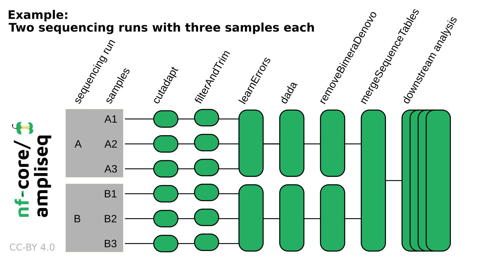

# nf-core/ampliseq: Usage

## :warning: Please read this documentation on the nf-core website: [https://nf-co.re/ampliseq/usage](https://nf-co.re/ampliseq/usage)

> _Documentation of pipeline parameters is generated automatically from the pipeline schema and can no longer be found in markdown files._

## Table of Contents

- [Running the pipeline](#running-the-pipeline)
  - [Quick start](#quick-start)
  - [Setting parameters in a file](#setting-parameters-in-a-file)
  - [Input specifications](#input-specifications)
    - [Sample sheet input](#sample-sheet-input)
    - [ASV/OTU fasta input](#asvotu-fasta-input)
    - [Direct FASTQ input](#direct-fastq-input)
  - [Regions of variable length e.g. ITS](#regions-of-variable-length-eg-its)
    - [ITS extraction tool](#its-extraction-tool)
  - [Decontamination](#decontamination)
  - [Taxonomic classification](#taxonomic-classification)
  - [Multiple region analysis with Sidle](#multiple-region-analysis-with-sidle)
  - [Metadata](#metadata)
  - [Differential abundance analysis](#differential-abundance-analysis)
  - [Phylogenetic placement](#phylogenetic-placement)
    - [Single reference phylogenetic placement](#single-reference-phylogenetic-placement)
    - [Multiple reference phylogenetic placement](#multiple-reference-phylogenetic-placement)
    - [Placement in database-provided phylogenies](#placement-in-database-provided-phylogenies)
  - [Updating the pipeline](#updating-the-pipeline)
  - [Reproducibility](#reproducibility)
- [Core Nextflow arguments](#core-nextflow-arguments)
  - [`-profile`](#-profile)
  - [`-resume`](#-resume)
  - [`-c`](#-c)
- [Custom configuration](#custom-configuration)
  - [Resource requests](#resource-requests)
  - [Custom Containers](#custom-containers)
  - [Custom Tool Arguments](#custom-tool-arguments)
  - [nf-core/configs](#nf-coreconfigs)
- [Running in the background](#running-in-the-background)
- [Nextflow memory requirements](#nextflow-memory-requirements)

## Running the pipeline

### Quick start

The typical command for running the pipeline is as follows:

```bash
nextflow run nf-core/ampliseq \
    -profile singularity \
    --input "samplesheet.tsv" \
    --FW_primer GTGYCAGCMGCCGCGGTAA \
    --RV_primer GGACTACNVGGGTWTCTAAT \
    --metadata "data/Metadata.tsv" \
    --outdir "./results"
```

In this example, `--input` is the [Sample sheet input](#sample-sheet-input), other options are [Direct FASTQ input](#direct-fastq-input) and [ASV/OTU fasta input](#asvotu-fasta-input). For more details on metadata, see [Metadata](#metadata). It is possible to not provide primer sequences (`--FW_primer` & `--RV_primer`) and skip primer trimming using `--skip_cutadapt`, but this is only for data that indeed does not contain any PCR primers in their sequences. Also, metadata (`--metadata`) isnt required, but aids downstream analysis.

This will launch the pipeline with the `singularity` configuration profile. See below [`-profile`](#profile) for more information about profiles.

Note that the pipeline will create the following files in your working directory:

```bash
work                # Directory containing the nextflow working files
<OUTDIR>            # Finished results in specified location (defined with --outdir)
.nextflow_log       # Log file from Nextflow
# Other nextflow hidden files, eg. history of pipeline runs and old logs.
```

> [!TIP]
> For [Reproducibility](#reproducibility), specify the version to run using `-r` (= release, e.g. 2.17.0, please use the most recent release). See the [nf-core/ampliseq website documentation](https://nf-co.re/ampliseq/parameters) for more information about pipeline specific parameters.

> [!NOTE]
> If the data originates from multiple sequencing runs, the error profile of each of those sequencing runs needs to be considered separately. Using the `run` column in the sample sheet input or adding `--multiple_sequencing_runs` for direct FASTQ input will separate certain processes by the sequencing run. Please see the following example:

<p align="center">
    
</p>

### Setting parameters in a file

If you wish to repeatedly use the same parameters for multiple runs, rather than specifying each flag in the command, you can specify these in a params file.

Pipeline settings can be provided in a `yaml` or `json` file via `-params-file <file>`.

> [!WARNING]
> Do not use `-c <file>` to specify parameters as this will result in errors. Custom config files specified with `-c` must only be used for [tuning process resource specifications](https://nf-co.re/docs/usage/configuration#tuning-workflow-resources), other infrastructural tweaks (such as output directories), or module arguments (args).

The above pipeline run specified with a params file in yaml format:

```bash
nextflow run nf-core/ampliseq -profile docker -params-file params.yaml
```

with:

```yaml title="params.yaml"
input: "samplesheet.tsv"
FW_primer: "GTGYCAGCMGCCGCGGTAA"
RV_primer: "GGACTACNVGGGTWTCTAAT"
metadata: "data/Metadata.tsv"
outdir: "./results"
<...>
```

You can also generate such `YAML`/`JSON` files via [nf-core/launch](https://nf-co.re/launch).

### Input specifications

The input data can be passed to nf-core/ampliseq in three possible ways using the parameters `--input`, `--input_fasta`, or `--input_folder`.
The three parameters and input types are mutually exclusive.

- [Sample sheet input](#sample-sheet-input) using `--input`: Sample sheet tab-separated, comma-separated, or in YAML format
- [ASV/OTU fasta input](#asvotu-fasta-input) using `--input_fasta`: Fasta file with sequences to be taxonomically classified
- [Direct FASTQ input](#direct-fastq-input) using `--input_folder`: Folder containing zipped FastQ files.

Optionally, a metadata sheet can be specified for downstream analysis.

#### Sample sheet input

The sample sheet file can be tab-separated (.tsv), comma-separated (.csv), or in YAML format (.yml/.yaml).

| Column        | Necessity | Description                                                                   |
| ------------- | --------- | ----------------------------------------------------------------------------- |
| sample        | required  | Unique sample identifiers (see below for requirements)                        |
| fastq_1       | required  | Paths to (forward) reads zipped FastQ files                                   |
| fastq_2       | optional  | Paths to reverse reads zipped FastQ files, required if the data is paired-end |
| run           | optional  | If the data was produced by multiple sequencing runs, any string              |
| control       | optional  | "control" or "sample" to allow decontamination with negative controls         |
| quant_reading | optional  | Quantification reading to allow decontamination based on abundances           |

The sample sheet can be specified with

```bash
--input 'path/to/samplesheet.tsv'
```

For example, the tab-separated sample sheet may contain:

| sample  | fastq_1                   | fastq_2                   | run | control | quant_reading |
| ------- | ------------------------- | ------------------------- | --- | ------- | ------------- |
| sample1 | ./data/S1_R1_001.fastq.gz | ./data/S1_R2_001.fastq.gz | A   | control | 1000          |
| sample2 | ./data/S2_fw.fastq.gz     | ./data/S2_rv.fastq.gz     | A   | sample  | 10000         |
| sample3 | ./S4x.fastq.gz            | ./S4y.fastq.gz            | B   | control | 1100          |
| sample4 | ./a.fastq.gz              | ./b.fastq.gz              | B   | sample  | 11000         |

Two header layouts are supported, a legacy and a standardized layout (the latter is described above):

| Layout       | Required columns           | Optional columns                                  |
| ------------ | -------------------------- | ------------------------------------------------- |
| Legacy       | `sampleID`, `forwardReads` | `reverseReads`, `run`, `control`, `quant_reading` |
| Standardized | `sample`, `fastq_1`        | `fastq_2`, `run`, `control`, `quant_reading`      |

Please note the following requirements:

- 2 to 6 columns/entries
- File extensions `.tsv`,`.csv`,`.yml`,`.yaml` specify the file type, otherwise file type will be derived from content, if possible
- Must contain either `sample` and `fastq_1` (standardized) OR `sampleID` and `forwardReads` (legacy)
- May contain `fastq_2`/`reverseReads`, `run`, `control`, and `quant_reading`
- Sample IDs must be unique
- Sample IDs must start with a letter
- Sample IDs can only contain letters, numbers or underscores
- FastQ files must be compressed (`.fastq.gz`, `.fq.gz`)
- Within one samplesheet, only one type of raw data should be specified (same amplicon & sequencing method)

Examples for both layouts are provided within the pipeline code in folder `assets` as `samplesheet_legacy.tsv` and `samplesheet_standardized.tsv`.

To avoid producing a sample sheet, [Direct FASTQ input](#direct-fastq-input) may be used instead.

#### ASV/OTU fasta input

To taxonomically classify pre-computed sequence files, a fasta format file with sequences may be provided.
Most of the steps of the pipeline will be skipped, but ITSx & Barrnap & length filtering can be applied before taxonomic classification.
The sequence header line may contain a description, that will be kept as part of the sequence name. However, tabs will be changed into spaces.

```bash
--input_fasta 'path/to/amplicon_sequences.fasta'
```

#### Direct FASTQ input

An easy way to input sequencing data to the pipeline is to specify directly the path to the folder that contains your input FASTQ files. For example:

```bash
--input_folder 'path/to/data/'
```

File names must follow a specific pattern, default is `/*_R{1,2}_001.fastq.gz`, but this can be adjusted with `--extension`.

For example, the following files in folder `data` would be processed as `sample1` and `sample2`:

```console
data
    |-sample1_1_L001_R1_001.fastq.gz
    |-sample1_1_L001_R2_001.fastq.gz
    |-sample2_1_L001_R1_001.fastq.gz
    |-sample2_1_L001_R2_001.fastq.gz
```

All sequencing data should originate from one sequencing run, because processing relies on run-specific error models that are unreliable when data from several sequencing runs are mixed. Sequencing data originating from multiple sequencing runs requires additionally the parameter `--multiple_sequencing_runs` and a specific folder structure, for example:

```console
data
    |-runA
    |   |-sample1_1_L001_R1_001.fastq.gz
    |   |-sample1_1_L001_R2_001.fastq.gz
    |   |-sample2_1_L001_R1_001.fastq.gz
    |   |-sample2_1_L001_R2_001.fastq.gz
    |
    |-runB
        |-sample3_1_L001_R1_001.fastq.gz
        |-sample3_1_L001_R2_001.fastq.gz
        |-sample4_1_L001_R1_001.fastq.gz
        |-sample4_1_L001_R2_001.fastq.gz
```

Where `sample1` and `sample2` were sequenced in one sequencing run and `sample3` and `sample4` in another sequencing run.

Please note the following additional requirements:

- Files names must be unique
- Valid file extensions: `.fastq.gz`, `.fq.gz` (files must be compressed)
- The path must be enclosed in quotes
- `--extension` must have at least one `*` wildcard character
- When using the pipeline with paired end data, the `--extension` must use `{1,2}` (or similar) notation to specify read pairs
- To run single-end data you must additionally specify `--single_end` and `--extension` may not include curly brackets `{}`
- Sample identifiers are extracted from file names, i.e. the string before the first underscore `_`, these must be unique (also across sequencing runs) and only contain letters, numbers or underscores
- If your data is scattered, produce a sample sheet

### Regions of variable length (e.g. ITS)

Special considerations should be made when pre-processing reads for regions of variable length, e.g. ITS for fungal barcoding. For ITS regions e.g. ITS1 or ITS2, it is recommended to use the `--illumina_pe_its` parameter for paired-end Illumina reads, which disables fixed-length read truncation. Also consider adjusting `--truncq` to a value higher than the default value of 2 if you find that a high proportion of reads is excluded by DADA2 filtering.

#### ITS extraction tool

By default, [ITSx](https://microbiology.se/software/itsx/) is used for ITS region extraction (`--its_extractor itsx`). As an alternative, [ITSxRust](https://github.com/ayobi/ITSxRust) can be used, which is optimized for long-read amplicon data from Oxford Nanopore and PacBio HiFi platforms:

```bash
--its_extractor itsxrust
```

ITSxRust automatically selects platform-appropriate presets: `--preset ont` by default, or `--preset hifi` when `--pacbio` is set. The required HMM profile is bundled in the container and Bioconda package, so no additional files need to be provided.

ITSxRust produces the same output files as ITSx and is fully compatible with all downstream steps including `--cut_its` and `--its_partial`.

#### Decontamination

[Decontam](https://doi.org/10.1186/s40168-018-0605-2) performs simple statistical identification and removal of contaminant sequences. Decontam is most useful with low biomass samples, where contamination removal is particularly impactful. The limitations and applications of Decontam have been extensively described in its [publication](https://doi.org/10.1186/s40168-018-0605-2) and [R package description](https://benjjneb.github.io/decontam/vignettes/decontam_intro.html). [Fierer et al. 2025](https://doi.org/10.1038/s41564-025-02035-2) compare concepts and methods for decontamiation including Decontam. Next, a brief explanation on how to use Decontam in the context of nf-core/ampliseq.

Decontam is applied to the abundance table with information from the sample sheet after ASV generation (or OTU clustering, if chosen), before ASV filtering by barrnap, length, and such. Required for using Decontam is at least one of DNA quantitation data and negative controls, that can be added in the sample sheet in optional columns `quant_reading` and `control`. Whenever at least one of those two columns is supplied, Decontam is applied to the data and the results are stored, however without further consequences. Filtering for downstream analysis is only applied when additionally specifying `--decontam decotaminate` or `--decontam notcontaminant`.

Decontam has two methods, the "frequency" method based on the distribution of the frequency of each sequence feature as a function of the input DNA concentration (sample sheet column `quant_reading`) and the "prevalence" method based on the prevalence (presence/absence across samples) of each sequence feature in true positive samples compared to the prevalence in negative controls (sample sheet column `control`). DNA quantitation data for the "frequency" method refers to DNA extraction concentration or to sequencing library input, optimally as standardized fluorescent intensities. The model requires a gradient of concentrations to detect contaminants that are more frequent in samples with low concentration reading than in samples with high quantification reading. The "frequency" method model assumptions are violated if microbial biomass systematically differs between sample groups. For the "prevalence" method, at least 3 negative controls are required, a minimum of 5 is recommended. The "prevalence" method has reduced sensitivity to detect contaminants present only in very few samples or with fewer negative controls.

Furthermore, Decontam tests two hypothesis, whether features [_are_ contaminants](https://rdrr.io/bioc/decontam/man/isContaminant.html) or are [_not_ contaminants](https://rdrr.io/bioc/decontam/man/isNotContaminant.html) (called "non-contaminants"). The former assumes all features are not contaminants and requires sufficient positive proof a feature is a "contaminant" before calling it so. The latter assumes that features are contaminants and requires sufficient proof a feature is not a contaminant before calling it "non-contaminant". Contaminants are identified based on the "frequency" method (sample sheet column `quant_reading`) or the "prevalence" method (sample sheet column `control`), or a combination of both, adjustable with `--decontam_decontaminate_method` (default: `auto` that chooses `frequency`, `prevalence` or `combined` based on the input). Non-contaminants are identified solely based on the "prevalence" method (sample sheet column `control`). The p-value thresholds can be adjusted with `--decontam_decontaminate_threshold` and `--decontam_notcontaminant_threshold`.

By default, the information of contaminants or non-contaminants are not further used. However, contaminants are removed with `--decontam decotaminate` from subsequent analysis or only non-contaminants are retained with `--decontam notcontaminant`.

### Taxonomic classification

Taxonomic classification of ASVs can be performed with tools DADA2, SINTAX, Kraken2 or QIIME2. Multiple taxonomic reference databases are pre-configured for those tools, but user supplied databases are also supported for some tools. Alternatively (or in addition), phylogenetic placement can be used to extract taxonomic classifications.

In case multiple tools for taxonomic classification are executed in one pipeline run, only the taxonomic classification result of one tool is forwarded to downstream analysis with QIIME2. The priority is `phylogenetic placement` > `DADA2` > `SINTAX` > `Kraken2` > `QIIME2`, that is by no means a recommendation for a specific tool but a technical limitation.

Default setting for taxonomic classification is DADA2 with the SILVA reference taxonomy database.

Pre-configured reference taxonomy databases are:

| Database key | DADA2 | SINTAX | Kraken2 | QIIME2 | Phyloplace | Target genes                                  |
| ------------ | ----- | ------ | ------- | ------ | ---------- | --------------------------------------------- |
| silva        | +¹    | -      | +       | +      | -          | 16S rRNA                                      |
| gtdb         | +²    | -      | -       | -      | -          | 16S rRNA                                      |
| sbdi-gtdb    | +     | -      | -       | -      | +          | 16S rRNA                                      |
| rdp          | +     | -      | +       | -      | -          | 16S rRNA                                      |
| greengenes   | -     | -      | +       | (+)³   | -          | 16S rRNA                                      |
| greengenes2  | +     | -      | -       | +      | -          | 16S rRNA                                      |
| pr2          | +     | -      | -       | -      | -          | 18S rRNA                                      |
| unite-fungi  | +     | +      | -       | -      | -          | eukaryotic nuclear ribosomal ITS region       |
| unite-alleuk | +     | +      | -       | -      | -          | eukaryotic nuclear ribosomal ITS region       |
| coidb        | +     | +      | -       | -      | -          | eukaryotic Cytochrome Oxidase I (COI)         |
| midori2-co1  | +     | -      | -       | -      | -          | eukaryotic Cytochrome Oxidase I (COI)         |
| phytoref     | +     | -      | -       | -      | -          | eukaryotic plastid 16S rRNA                   |
| zehr-nifh    | +     | -      | -       | -      | -          | Nitrogenase iron protein NifH                 |
| standard     | -     | -      | +       | -      | -          | any in genomes of archaea, bacteria, viruses⁴ |

¹: As of Silva version 138 optimized for classification of Bacteria and Archaea, not suitable for Eukaryotes; ²[`--dada_taxonomy_rc`](https://nf-co.re/ampliseq/parameters#dada_taxonomy_rc) is recommended; ³: de-replicated at 85%, only for testing purposes; ⁴: quality of results might vary

Special features of taxonomic classification tools:

- DADA2's reference taxonomy databases **can** have regions matching the amplicon extracted with primer sequences.
- Kraken2 is very fast and can use large databases containing complete genomes.
- QIIME2's reference taxonomy databases will have regions matching the amplicon extracted with primer sequences.
- DADA2, Kraken2, QIIME2, and SINTAX have specific parameters to accept custom databases (but theoretically possible with all classifiers).
- Phyloplace assigns taxonomy by placement on reference phylogenies provided with the database, see [Placement in database provided phylogenies](#placement-in-database-provided-phylogenies).

Parameter guidance is given in [nf-core/ampliseq website parameter documentation](https://nf-co.re/ampliseq/parameters/#taxonomic-assignment). Citations are listed in [`CITATIONS.md`](CITATIONS.md).

> [!TIP]
> Taxonomic reference databases can be stored and shared locally with [`--ref_taxonomy_storage`](https://nf-co.re/ampliseq/parameters/#ref_taxonomy_storage). That way, remote files will be downloaded only if they are not available in the storage directory.

### Multiple region analysis with Sidle

Instead of relying on one short amplicon, scaffolding multiple regions along a reference can improve resolution over a single region. This method applies [Sidle (SMURF Implementation Done to acceLerate Efficiency)](https://github.com/jwdebelius/q2-sidle) within [QIIME2](https://qiime2.org/) with [Silva](https://www.arb-silva.de/) (see [licence](https://www.arb-silva.de/silva-license-information/)) or [Greengenes](http://greengenes.microbio.me/greengenes_release/) database.

For example, multiple variable regions of the 16S rRNA gene were sequenced with various primers and need to be unified. This leads to one unified abundance and taxonomy profile over all variable regions. However, ASV sequences are only available separately, there is no reconstruction of complete de-novo sequences feasible.

Information about sequencing data via [`--input`](#sample-sheet-input), region primers length information via [`--multiregion`](https://nf-co.re/ampliseq/parameters#multiregion), and a taxonomic database via [`--sidle_ref_taxonomy`](https://nf-co.re/ampliseq/parameters#sidle_ref_taxonomy) or [`--sidle_ref_tax_custom`](https://nf-co.re/ampliseq/parameters#sidle_ref_tax_custom) with [`--sidle_ref_seq_custom`](https://nf-co.re/ampliseq/parameters#sidle_ref_seq_custom) is required.

```bash
--input "samplesheet_multiregion.tsv"  --multiregion "regions_multiregion.tsv" --sidle_ref_taxonomy "silva=128"
```

The region information file can be tab-separated (.tsv), comma-separated (.csv), or in YAML format (.yml/.yaml) and can have two to four columns/entries with the following headers:

| Column        | Description                                                               |
| ------------- | ------------------------------------------------------------------------- |
| region        | Unique region identifier                                                  |
| region_length | Minimum region length, sequences are trimmed and shorter ones are omitted |
| FW_primer     | Forward primer sequence                                                   |
| RV_primer     | Reverse primer sequence                                                   |

For example, the tab-separated `regions_multiregion.tsv` may contain:

| region  | FW_primer             | RV_primer            | region_length |
| ------- | --------------------- | -------------------- | ------------- |
| region1 | TGGCGAACGGGTGAGTAA    | CCGTGTCTCAGTCCCARTG  | 145           |
| region2 | ACTCCTACGGGAGGCAGC    | GTATTACCGCGGCTGCTG   | 135           |
| region3 | GTGTAGCGGTGRAATGCG    | CCCGTCAATTCMTTTGAGTT | 200           |
| region4 | GGAGCATGTGGWTTAATTCGA | CGTTGCGGGACTTAACCC   | 115           |
| region5 | GGAGGAAGGTGGGGATGAC   | AAGGCCCGGGAACGTATT   | 150           |

> [!WARNING]
> Several downstream filtering options are not allowed or disabled when analysing multi region data. Disabled functions are any ASV postprocessing/filtering options that require sequences and also no sample subsetting using the metadata sheet is available (i.e. if provided, the metadata sheet has to include all samples that pass preprocessing).

### Metadata

Metadata is optional, but for performing downstream analysis such as barplots, diversity indices or differential abundance testing, a metadata file is essential.

> [!TIP]
> The metadata defines what samples are entering downstream analysis. For example, when having negative controls in the sample sheet, those can be omitted in the metadata sheet and will not enter downstream analysis with QIIME2.

```bash
--metadata "path/to/metadata.tsv"
```

For example:

| ID      | condition |
| ------- | --------- |
| sample1 | control   |
| sample2 | treatment |
| sample3 | control   |
| sample4 | treatment |

Please note the following requirements:

- The path must be enclosed in quotes
- The metadata file has to follow the QIIME2 specifications (https://docs.qiime2.org/2021.2/tutorials/metadata/)

The metadata file must be tab-separated with a header line. The first column in the tab-separated metadata file is the sample identifier column (required header: ID) and defines the sample or feature IDs associated with the dataset. In addition to the sample identifier column, the metadata file is required to have at least one column with multiple different non-numeric values but not all unique.

Sample identifiers should be 36 characters long or less, and also contain only ASCII alphanumeric characters (i.e. in the range of [a-z], [A-Z], or [0-9]), or the underscore (\_) character. For downstream analysis, by default all numeric columns, blanks or NA are removed, and only columns with multiple different values but not all unique are selected.

The columns which are to be assessed can be specified by `--metadata_category`. If `--metadata_category` isn't specified than all columns that fit the specification are automatically chosen.

### Differential abundance analysis

Differential abundance analysis for relative abundance from microbial community analysis are plagued by multiple issues that aren't fully solved yet. But some approaches seem promising, for example Analysis of Composition of Microbiomes with Bias Correction ([ANCOM-BC](https://pubmed.ncbi.nlm.nih.gov/32665548/)). [ANCOM](https://pubmed.ncbi.nlm.nih.gov/26028277/) and ANCOM-BC are integrated into the pipeline, but only executed on request via `--ancom` and `--ancombc`, more details in the [nf-core/ampliseq website parameter documentation](https://nf-co.re/ampliseq/parameters/#differential-abundance-analysis).

### Phylogenetic placement

The pipeline can perform phylogenetic placement of ASV sequences in reference trees using [EPA-NG](https://github.com/pierrebarbera/epa-ng) using the same code as [nf-core/phyloplace](https://nf-co.re/phyloplace).
This can be done either a single reference for all ASV sequences, or multiple references, see below.

#### Single reference phylogenetic placement

Adding the parameters `--pplace_tree`, `--place_aln`, `--pplace_alnmethod`, `--place_model`, `--pplace_taxonomy` and `--pplace_name` will perform phylogenetic placement of ASV sequences in the specified reference phylogeny.
See the [nf-core/ampliseq parameter documentation](https://nf-co.re/ampliseq/parameters) for more information about the parameters.

#### Multiple reference phylogenetic placement

The pipeline can select reference trees for placement from a set by first running [HMMER](http://hmmer.org/).
The set is provided with a spreadsheet passed to the [`--pplace_sheet`](https://nf-co.re/ampliseq/parameters#pplace_sheet), see example below.
Each row in the spreadsheet needs to specify at least `target` and `hmm`.
For each ASV sequence, the best matching hmm profile decides which reference phylogeny, if any, will be used for placement.
When there's a `refseqfile`, `refphylogeny`, `model` and `taxonomy`, best matching ASV sequences will be placed in the specified phylogeny.
If there is no reference tree information, ASV sequences matching these hmm profiles best will not be placed.
The latter can be used to attract false positive sequences away from being placed in any of the trees.
For hmm files with multiple profiles, the `extract_hmm` specifies which profile to use.
Finally, you can specify `min_bitscore` to set a minimum score for a sequence to be included in further processing.

> [!NOTE]
> For different reasons, taxonomies created by phylogenetic placement in multiple reference trees are currently not used as taxonomy for downstream analyses such as QIIME2.

```csv title="pplace_sheet.csv"
target,alignmethod,hmm,extract_hmm,refseqfile,refphylogeny,model,taxonomy
archaea16s,clustalo,https://raw.githubusercontent.com/tseemann/barrnap/master/db/arc.hmm,16S_rRNA,archaea.newick,archaea.alnfna,GTR+F+I+G4,archaea.taxonomy.tsv
bacteria16s,clustalo,https://raw.githubusercontent.com/tseemann/barrnap/master/db/bac.hmm,16S_rRNA,bacteria.newick,bacteria.alnfna,GTR+F+I+G4,bacteria.taxonomy.tsv
euk18s,clustalo,https://raw.githubusercontent.com/tseemann/barrnap/master/db/euk.hmm,18S_rRNA,,,,
```

#### Placement in database-provided phylogenies

Reference databases for taxonomy can provide reference phylogenies for placement (currently only SBDI-GTDB from release R10-RS226-2).
This is not run by default since it takes quite a lot of resources.
If you want to enable this, set `--run_pplace`.

> [!NOTE]
> Since phylogenetic placement requires a lot of memory when the reference phylogeny is large, we have set the minimum memory for two processes to 60 GiB in order to work with the GTDB bacterial tree. If your tree is smaller, the setting can be lowered for the `EPANG_PLACE` and `GAPPA_ASSIGN` processes, see [resource requests](#resource-requests) below.

### Updating the pipeline

When you run the below command, Nextflow automatically pulls the pipeline code from GitHub and stores it as a cached version. When running the pipeline after this, it will always use the cached version if available - even if the pipeline has been updated since. To make sure that you're running the latest version of the pipeline, make sure that you regularly update the cached version of the pipeline:

```bash
nextflow pull nf-core/ampliseq
```

### Reproducibility

It is a good idea to specify the pipeline version when running the pipeline on your data. This ensures that a specific version of the pipeline code and software are used when you run your pipeline. If you keep using the same tag, you'll be running the same version of the pipeline, even if there have been changes to the code since.

First, go to the [nf-core/ampliseq releases page](https://github.com/nf-core/ampliseq/releases) and find the latest pipeline version - numeric only (eg. `2.17.0`). Then specify this when running the pipeline with `-r` (one hyphen) - eg. `-r 2.17.0`. Of course, you can switch to another version by changing the number after the `-r` flag.

This version number will be logged in reports when you run the pipeline, so that you'll know what you used when you look back in the future. For example, at the bottom of the MultiQC reports.

To further assist in reproducibility, you can use share and reuse [parameter files](#running-the-pipeline) to repeat pipeline runs with the same settings without having to write out a command with every single parameter.

> [!TIP]
> If you wish to share such profile (such as upload as supplementary material for academic publications), make sure to NOT include cluster specific paths to files, nor institutional specific profiles.

## Core Nextflow arguments

> [!NOTE]
> These options are part of Nextflow and use a _single_ hyphen (pipeline parameters use a double-hyphen)

### `-profile`

Use this parameter to choose a configuration profile. Profiles can give configuration presets for different compute environments.

Several generic profiles are bundled with the pipeline which instruct the pipeline to use software packaged using different methods (Docker, Singularity, Podman, Shifter, Charliecloud, Apptainer, Conda) - see below.

> [!IMPORTANT]
> We highly recommend the use of Docker or Singularity containers for full pipeline reproducibility, however when this is not possible, Conda is also supported.

The pipeline also dynamically loads configurations from [https://github.com/nf-core/configs](https://github.com/nf-core/configs) when it runs, making multiple config profiles for various institutional clusters available at run time. For more information and to check if your system is supported, please see the [nf-core/configs documentation](https://github.com/nf-core/configs#documentation).

Note that multiple profiles can be loaded, for example: `-profile test,docker` - the order of arguments is important!
They are loaded in sequence, so later profiles can overwrite earlier profiles.

If `-profile` is not specified, the pipeline will run locally and expect all software to be installed and available on the `PATH`. This is _not_ recommended, since it can lead to different results on different machines dependent on the computer environment.

- `test`
  - A profile with a complete configuration for automated testing
  - Includes links to test data so needs no other parameters
- `docker`
  - A generic configuration profile to be used with [Docker](https://docker.com/)
- `singularity`
  - A generic configuration profile to be used with [Singularity](https://sylabs.io/docs/)
- `podman`
  - A generic configuration profile to be used with [Podman](https://podman.io/)
- `shifter`
  - A generic configuration profile to be used with [Shifter](https://nersc.gitlab.io/development/shifter/how-to-use/)
- `charliecloud`
  - A generic configuration profile to be used with [Charliecloud](https://charliecloud.io/)
- `apptainer`
  - A generic configuration profile to be used with [Apptainer](https://apptainer.org/)
- `wave`
  - A generic configuration profile to enable [Wave](https://seqera.io/wave/) containers. Use together with one of the above (requires Nextflow ` 24.03.0-edge` or later).
- `conda`
  - A generic configuration profile to be used with [Conda](https://conda.io/docs/). Please only use Conda as a last resort i.e. when it's not possible to run the pipeline with Docker, Singularity, Podman, Shifter, Charliecloud, or Apptainer.

### `-resume`

Specify this when restarting a pipeline. Nextflow will use cached results from any pipeline steps where the inputs are the same, continuing from where it got to previously. For input to be considered the same, not only the names must be identical but the files' contents as well. For more info about this parameter, see [this blog post](https://www.nextflow.io/blog/2019/demystifying-nextflow-resume.html).

You can also supply a run name to resume a specific run: `-resume [run-name]`. Use the `nextflow log` command to show previous run names.

### `-c`

Specify the path to a specific config file (this is a core Nextflow command). See the [nf-core website documentation](https://nf-co.re/usage/configuration) for more information.

## Custom configuration

### Resource requests

Whilst the default requirements set within the pipeline will hopefully work for most people and with most input data, you may find that you want to customise the compute resources that the pipeline requests. Each step in the pipeline has a default set of requirements for number of CPUs, memory and time. For most of the pipeline steps, if the job exits with any of the error codes specified [here](https://github.com/nf-core/rnaseq/blob/4c27ef5610c87db00c3c5a3eed10b1d161abf575/conf/base.config#L18) it will automatically be resubmitted with higher resources request (2 x original, then 3 x original). If it still fails after the third attempt then the pipeline execution is stopped.

To change the resource requests, please see the [max resources](https://nf-co.re/docs/usage/configuration#max-resources) and [tuning workflow resources](https://nf-co.re/docs/usage/configuration#tuning-workflow-resources) section of the nf-core website.

### Custom Containers

In some cases, you may wish to change the container or conda environment used by a pipeline steps for a particular tool. By default, nf-core pipelines use containers and software from the [biocontainers](https://biocontainers.pro/) or [bioconda](https://bioconda.github.io/) projects. However, in some cases the pipeline specified version maybe out of date.

To use a different container from the default container or conda environment specified in a pipeline, please see the [updating tool versions](https://nf-co.re/docs/usage/configuration#updating-tool-versions) section of the nf-core website.

### Custom Tool Arguments

A pipeline might not always support every possible argument or option of a particular tool used in pipeline. Fortunately, nf-core pipelines provide some freedom to users to insert additional parameters that the pipeline does not include by default.

To learn how to provide additional arguments to a particular tool of the pipeline, please see the [customising tool arguments](https://nf-co.re/docs/usage/configuration#customising-tool-arguments) section of the nf-core website.

### nf-core/configs

In most cases, you will only need to create a custom config as a one-off but if you and others within your organisation are likely to be running nf-core pipelines regularly and need to use the same settings regularly it may be a good idea to request that your custom config file is uploaded to the `nf-core/configs` git repository. Before you do this please can you test that the config file works with your pipeline of choice using the `-c` parameter. You can then create a pull request to the `nf-core/configs` repository with the addition of your config file, associated documentation file (see examples in [`nf-core/configs/docs`](https://github.com/nf-core/configs/tree/master/docs)), and amending [`nfcore_custom.config`](https://github.com/nf-core/configs/blob/master/nfcore_custom.config) to include your custom profile.

See the main [Nextflow documentation](https://www.nextflow.io/docs/latest/config.html) for more information about creating your own configuration files.

If you have any questions or issues please send us a message on [Slack](https://nf-co.re/join/slack) on the [`#configs` channel](https://nfcore.slack.com/channels/configs).

## Running in the background

Nextflow handles job submissions and supervises the running jobs. The Nextflow process must run until the pipeline is finished.

The Nextflow `-bg` flag launches Nextflow in the background, detached from your terminal so that the workflow does not stop if you log out of your session. The logs are saved to a file.

Alternatively, you can use `screen` / `tmux` or similar tool to create a detached session which you can log back into at a later time.
Some HPC setups also allow you to run nextflow within a cluster job submitted your job scheduler (from where it submits more jobs).

## Nextflow memory requirements

In some cases, the Nextflow Java virtual machines can start to request a large amount of memory.
We recommend adding the following line to your environment to limit this (typically in `~/.bashrc` or `~./bash_profile`):

```bash
NXF_OPTS='-Xms1g -Xmx4g'
```
